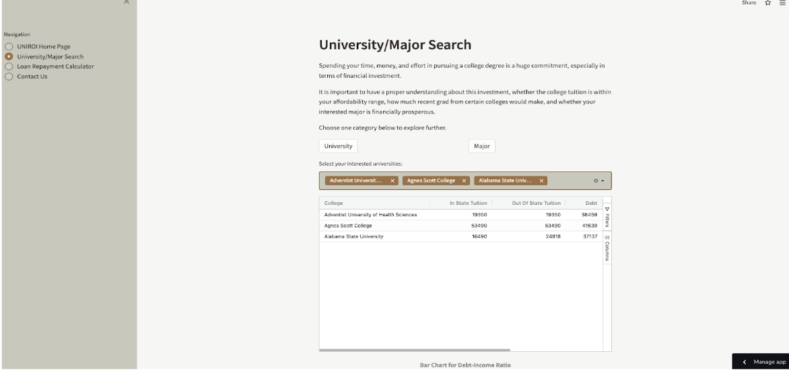
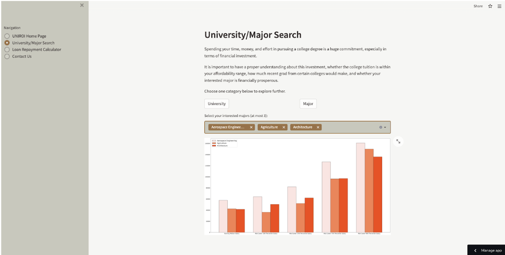
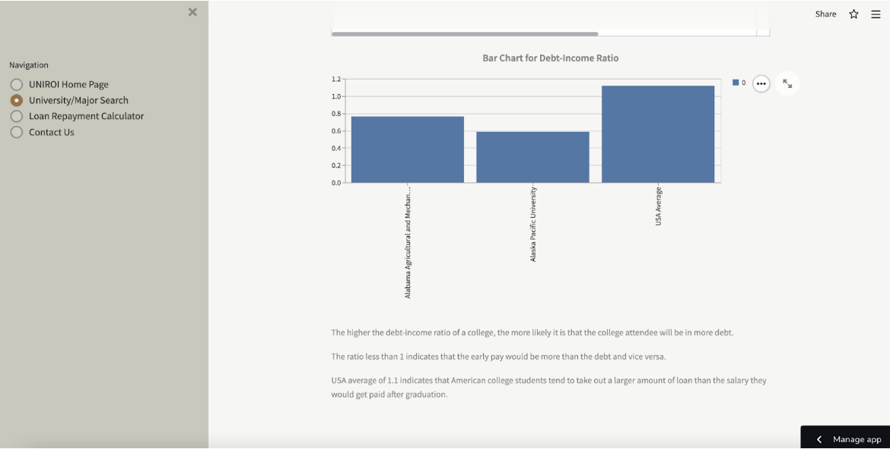
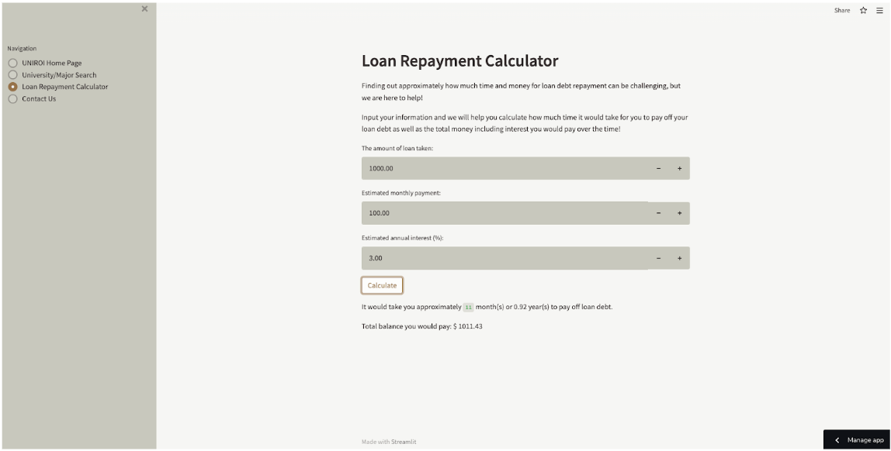

# College Return on Investment

## Project goal
Building a tool to determine the financial worth of pursuing a specific major from a given college.

## Motivation
Deciding on a college degree comes with numerous factors to consider. Many first-generation college students and underrepresented minorities often lack guidance. With the average American college graduate being $30,000 in debt, we aim to shed light on the financial aspects of obtaining a degree.

<!-- - [College Return on Investment](https://share.streamlit.io/jieni-yan/college-return-on-investment/main) -->
## Architecture and Components
Our project leverages Streamlit for website hosting and Firestore for data storage.

### Security
Secrets like `secrets.tol` and `firestore-key.json` are not committed to Git for privacy reasons.

### App Layout
1. **UNIROI Home Page**: Introduction to the platform.

2. **University/Major Search**: 
   - **University Subpage**: Choose universities for a comparative bar graph and detailed table.
   
   - **Major Subpage**: Compare up to three majors, visualized via a bar graph.
   
3. **Loan Repayment Calculator**: Provide debt, payments, and interest rates to determine repayment details.

4. **Contact Us**: User feedback submission with entries saved to our database.

## Data Flow

### Data Sources
- https://www.kaggle.com
- https://www.newyorkfed.org
- https://studentaid.gov/

### Firestore Structure
- Portfolio-by-Location-by-Age collection
- Portfolio-by-Location-by-Debt-Size collection
- degrees-that-pay-back collection
- salaries-by-college-type collection
- salaries-by-region collection
- salary_potential collection
- student-loan-by-state collection
- tuition_cost collection

### Data Retrieval
- **For University**: Universities are first fetched from `tuition_cost`. The user's selections guide data retrieval from related collections.
- **For Majors**: All majors are listed from `degrees-that-pay-back`. The user's choices determine which data to retrieve and display in bar graph format.

### User Data Upload
User feedback from the `Contact Us` page is saved in the `contact_us` Firestore collection.

---

## Developers
- Duyen Nguyen
- Jieni Yan
- Kaiyin Chan
